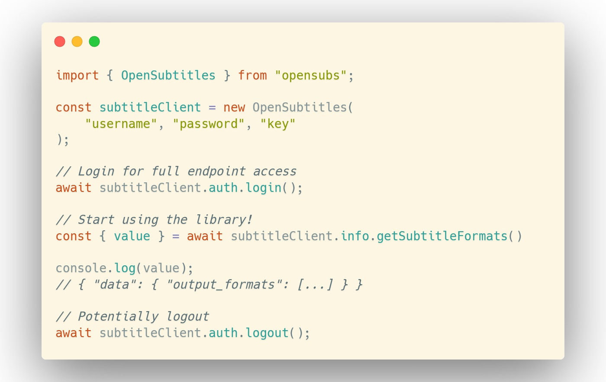

<div align="center">


<picture>
    <source media="(prefers-color-scheme: dark)" srcset="banner-dark.png" width="800px">
    <source media="(prefers-color-scheme: light)" srcset="banner-light.png" width="800px">
    
</picture>
</div>

### Getting started
Install the module using your package manager of choice:

```shell
$ npm install opensubs
$ yarn add opensubs
$ pnpm install opensubs
```

To start accessing the API, you will need a username, password, and an API key. The key may be created in the consumers section of your profile [here](https://www.opensubtitles.com/en/consumers). With this, you may now instantiate the `OpenSubtitles` client:

```typescript
import { OpenSubtitles } from "opensubs";

const subtitleClient = new OpenSubtitles(
    "username", "password", "key"
);
```
At this point you're good to go for almost all the API calls! Some require the user JWT, so I would recommend calling `await subtitleClient.auth.login()` to make sure the library updates your credentials. This is all done internally, and you do not have to worry about a thing!

### Choosing a server
The constructor accepts a 4th optional argument, which specifies which server to use. The default value is `Servers.PRIMARY`, however, if you're a VIP user, feel free to pass in `Servers.VIP`. There's a 3rd option, `Servers.MOCK`, which tends to be more lenient in terms of data returned and credential + header checks. This could be a useful option if you're stubbing out UIs. Enum may be found [here](src/constants/Servers.ts).

### Supported calls
The spec that was followed during development of this library may be found [here](https://opensubtitles.stoplight.io/), and, in addition to this, I tried to make sure all the function headers/comments were easy to understand (and they included example responses). Below is a table listing all the calls `opensubs` supports at a glance.

| Library call        | Params                          |
|---------------------|---------------------------------|
| client.auth.login() | N/A                             |
| client.auth.logout() | N/A                             |
| client.discover.getPopularFeatures() | languages: string, type: string |
| client.discover.getLatestSubtitles() | languages: string, type: string |
| client.discover.getMostDownloaded() | languages: string, type: string |
| client.download.requestDownload() | RequestDownloadParams           |
| client.features.findFeatures() | FindFeaturesParams              |
| client.info.getSubtitleFormats()  | N/A                             |
| client.info.getLanguages()  | N/A                             |
| client.info.getUserInformation()  | N/A                             |
| client.subtitles.findSubtitles() | FindSubtitlesParams             |
| client.utilities.guessIt() | filename: string                |


### Testing


### Upcoming work
In no particular order, here's a list of incoming features:

- **Automatic login**: Since some endpoints require a JWT, one will need to explicitly call `await myClient.auth.login()` to have the `CredentialManager` populate the JWT field. In the future, an additional flag may be passed during `OpenSubtitles()` initialization that will automatically perform this call so that one won't have to worry about it.
- **Improved error handling**:
- **Automatic server selection**:

### Similar Projects
If this wrapper doesn't tickle your fancy, there are several other options out there on GitHub - check them out!
- **[opensubtitles.com](https://github.com/vankasteelj/opensubtitles.com)**
- **[node-opensubtitles-api](https://github.com/ka2er/node-opensubtitles-api)** (Callback, not async/await based)